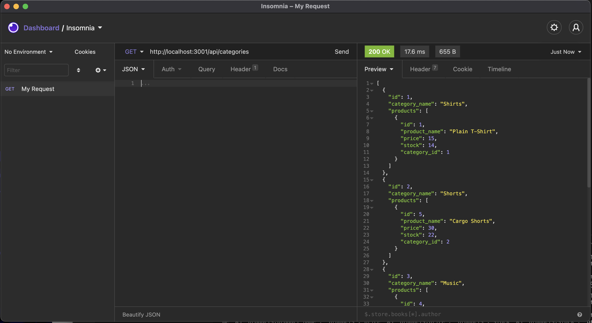

 https://opensource.org/licenses/ISC
  
  # Ecommerce Backend Project
  
  ## Description:
  This project utilised sequalize, node.js, express.js and mySQL in order to create and run a database capable of managing the stock of an ecommerce website. Using GET, POST, PUT and DELETE methods, the admin is able to view and update stock.
  
  ## Table of contents:
  - [Installation](#installation)
  - [Usage](#usage)
  - [Contribution](#contribution)
  - [Test](#test)
  - [License](#license)
  - [Image](#image)
  - [Video](#video)
  - [Questions](#questions)

  ## Installation
  In order to use this program, sequalize, express.js and mySQL2 are required. These are stored in the dependencies in the package.json file and, as such, simply running "npm i" in the terminal will install all required packages

  ## Usage
  Free to use

  ## Contribution
  Free to contribute

  ## Test
  No tests have been developed as of yet

  ## License
  ISC

  ## Image
  

  ## Video
  https://drive.google.com/file/d/1YZkCcuoDNDlE8xfzc8icWWdIdjph8mTa/view?usp=sharing

  ## Questions
  Github: https://github.com/SamuelHeal
  Email: samuelheal@hotmail.com
  